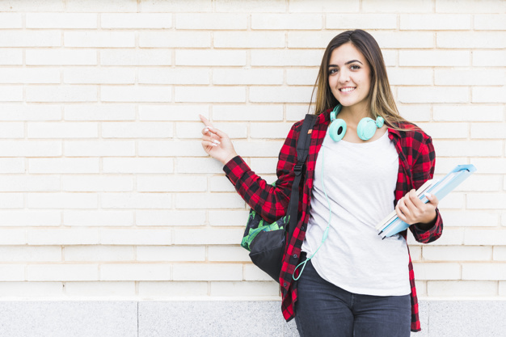

# SafeHaven, Phase 1: User Inquiry and Inspection

## Methods

Due to the sensitive nature of our proposed application, time constraints, and the recent Covid-19 outbreak, we opted to distribute a digital survey to gauge the utility our application might provide users, as well as gather demographic information. That, and we determined using a digital survey would enable us to reach the largest set of possible users at the lowest cost.  In total, we received responses from 18 users to our survey.

## Findings

From our survey we found:
- The majority of respondents seem to feel completely or reasonably safe in their day-to-day, commuting predominately by foot and car to and from work or school.
- The majority of respondents also request their friends and family to contact them when they return home safely, presumably over text or phone call.
- Most respondents allow friends or family to see their location at all times.
- Simple text messaging, phone calls, and smartphone location sharing services already provide for most of the user’s needs in requesting help during an emergency or if the user feels unsafe.

## Conclusions

We find that most needs of users we had intended to target with our application are already fulfilled by widespread technologies. So, we’ve decided to narrow our focus on streamlining the process of calling out to a user’s safety net for help. We suspect that in an emergency, a simplified means of sending out the call for help (e.g. a single button or gesture) may increase the likelihood of users commiting to call for help.

## Caveats

Due to the limitation of Chico IBR not allowing us to conduct research on human subjects; we collected data from a small sample size where the majority of respondents were male. 

From the results, we have acknowledged that some information is ambiguous as we should have asked more detailed questions. For example, we should have asked respondents to number their most used ways of transportation by how frequently they do so. 

Also because of the sensitivity of the situations, we can only rely on interviews and surveys as we cannot do naturalistic observations and contextual inquiry. That means we do not know for sure their ways of transportation.

## Personas

 
Image: Freepik.com 
Male college student - Mark is a 23-year-old white student athlete that devotes his time to his sport and classwork. On the weekends he likes to spend most of his time with friends and enjoys going out to the bar. He is the one that tends to look over all of his friends to make sure they are alright when they go out to the town. He would like to have an easy way to keep track of his friends when they are together and make sure everyone is safe.  - 

 
Image: Freepik.com 
Female college student - Jenny is a 21-year-old Indian college student. She is a bookworm that starts and ends her day at school. When she is not in class she is at the library. Her house is a couple of blocks away so she usually walks home when it is dark outside. She does not feel safe most of the time and her friends always worry about her safety. She wants an easy way to connect with her friends if something was to go wrong. It will make her feel more comfortable than to walk home.

## Scenarios

1. Mark is at the bar with his friends, all of them are intoxicated except for him. He takes a couple friends home but some of them are taking different means of transportation. He wants to make sure they all get home safely.

2. It's 8 PM and Jenny wants to let her friend know that she is going to leave the library, she’s in a rush as it’s going to start raining again. As she is walking home she feels someone is following her. Looking back she notices a figure heading in the same direction she is. She turns at a nearby street to her dismay the figure turns into the same street as well. She wants to tell her friends that she does not feel safe and needs help.

## Supplementary Materials

[Survey](https://docs.google.com/forms/d/181i4Fe-o_I_vdK78VH5YWM4Y6zJde0yRBN5Vszi49lA/edit) 
[Responses](https://docs.google.com/spreadsheets/d/130558LFeDmlgOYtwOskHl9IXTZS_g0oSS0qfQBmJuqM/edit#gid=125094958)
