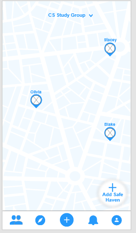
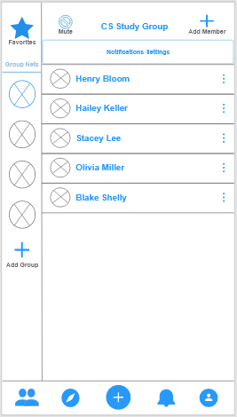
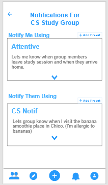
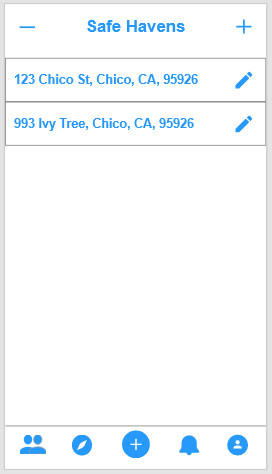
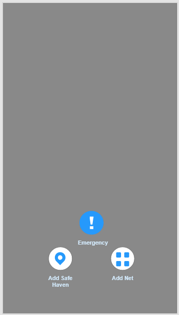
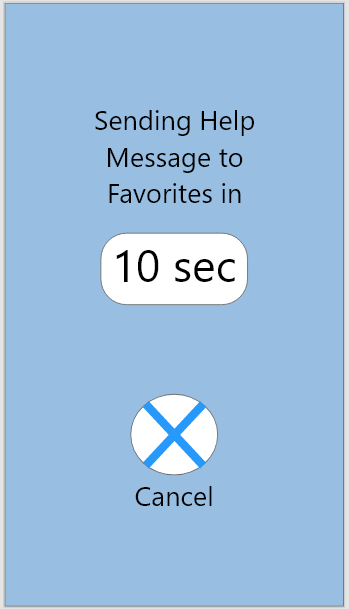
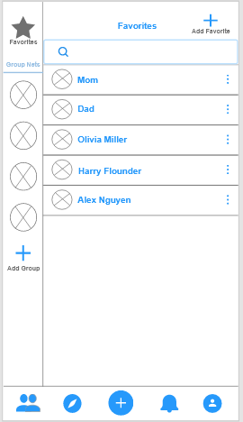
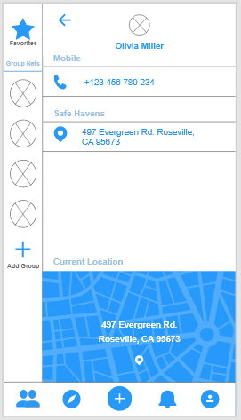

## Phase 2: Interaction Design

## Map
 

Whether something has occurred to you or you just wanted to check in on your friend after a night around town, we gave the users a way to know where their friend/family is located so that coming to their aid would require less effort if one needed help. 

## Group 
 

We were motivated by Mark’s scenario in which we wanted to make sure his friends were safe. We wanted a quick access between different groups of friends, whether temporary or permanent, that would make tracking your friends more efficient and safe.

## Notification 
 

We have personalized settings for each individual group so a user can manage the information they would like to receive or and the information other groups will receive about themselves. From our personas, Mark is someone who is very protective of those he cares about so having custom notification settings is handy for someone who likes to make sure everyone is okay. Each situation is different, Mark’s scenario was at the bar so maybe he would have certain settings for that situation but for his family group he might have a different preset to accommodate for their situation. 

## Safehaven
 

With most people in our survey stating they do not feel safe traveling alone, we thought it was a good idea to allow users to add their “Safe Havens”. Places that are considered safe to the user so that your friends can know when you have reached your destination.

## Emergency
 

 

We set a 'more'/quick-action button in the quick toolbar in the middle for fast access and set a single place to send a distress call to all your group members. This is because in Jenny’s scenario when feeling unsafe, we would want to be able to notify friends and family as quickly as possible. The survey showed that a lot of people seemed to walk unaccompanied.

## Favorites
 
We gave the users the option to favorite their most used or important contacts to easily access. If favored, these will be sent an automatic message if the user sets off the emergency call.

## Contact
 
 We have a contact page that shows the selected person’s contact information and “safe havens”. This feature was included so that if we ever needed to contact the person specifically we have the option to do so. This satisfies not only groups but individual interaction.
